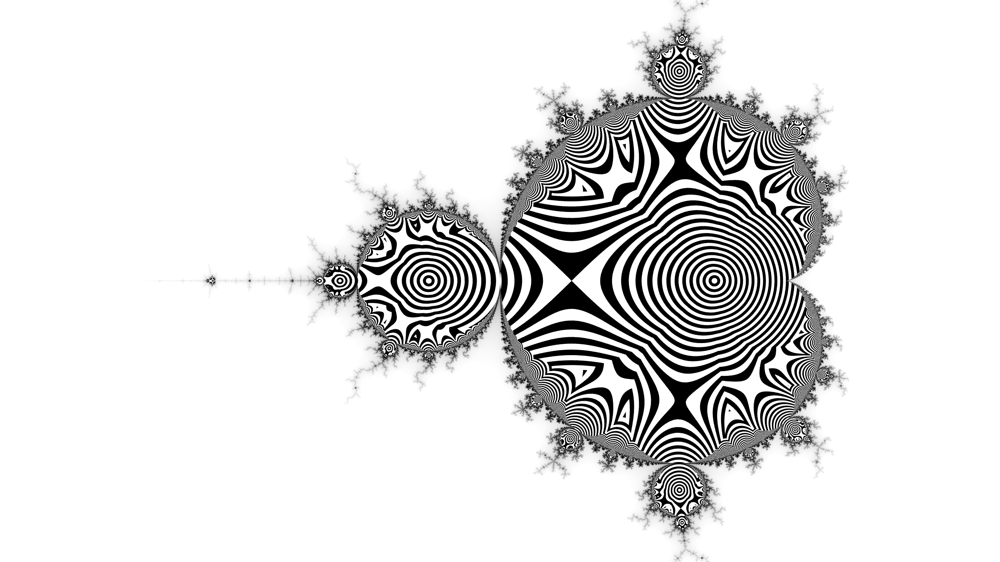
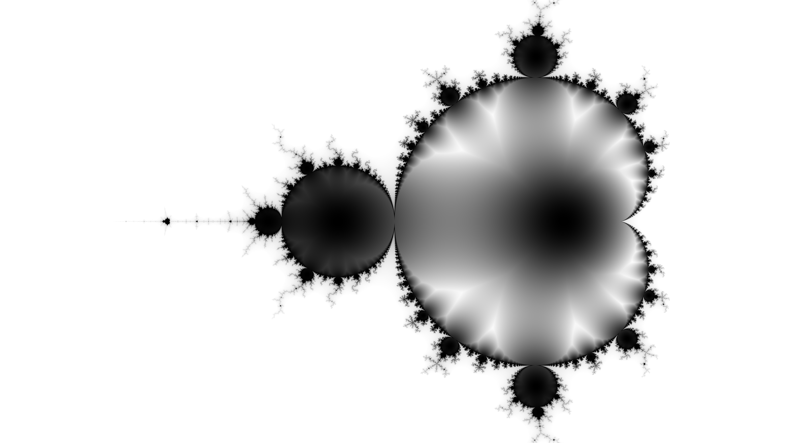
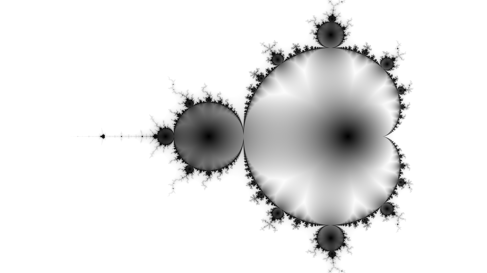

## Mandelbrot Trajectory Infima

These renders below are the result of considering the "trajectories" of points inside the mandelbrot
set when iterating . Specifically, looking at the closest point on such a
trajectory to the origin . As far
as I can tell, this was first described / explored in a 1986 book "The Beauty of Fractals".

### References
* [Displaying the Internal Structure of the Mandelbrot Set](https://www.acsu.buffalo.edu/~adamcunn/downloads/MandelbrotSet.pdf)
* The Beauty of Fractals, 1986, by Prof. Dr. Heinz-Otto Peitgen and Prof. Dr. Peter H. Richter.
